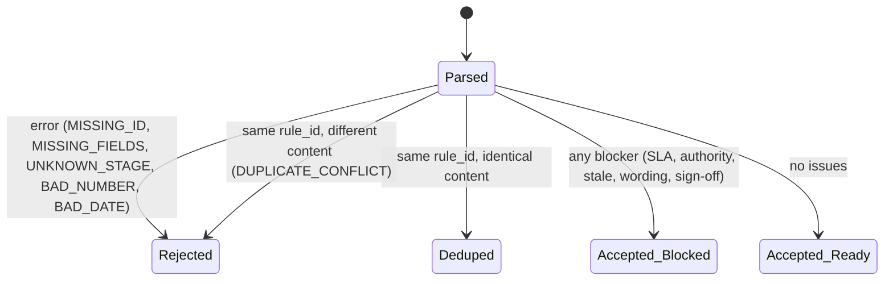
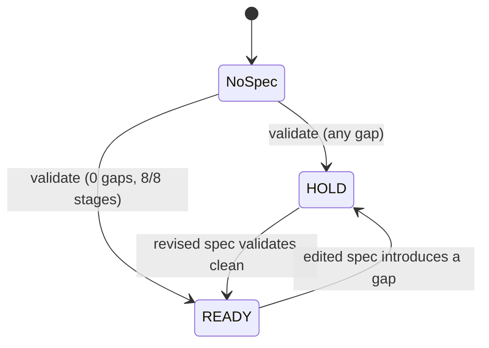
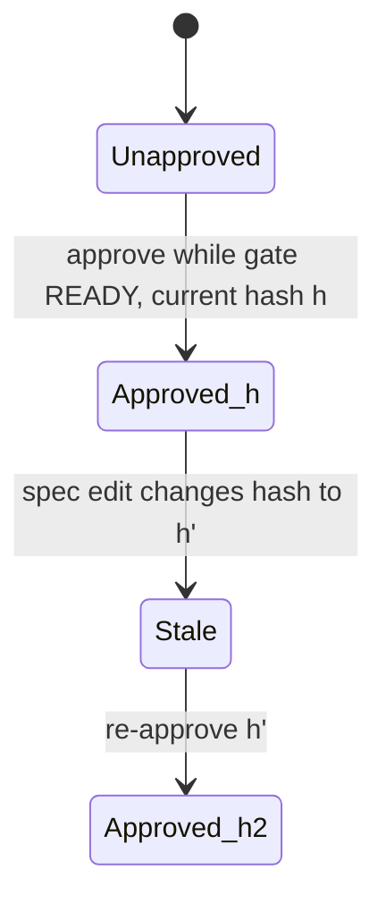
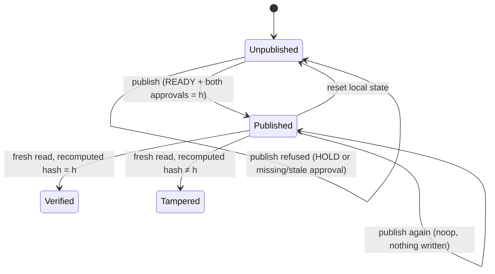
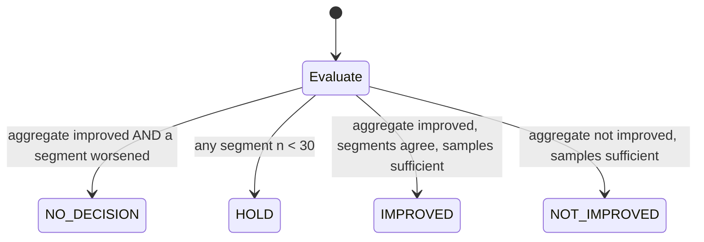

# State machines

These are as implemented in `public/engine.js` and `public/app.js`.

## 1. Spec row

## 2. Launch gate

Gap = any `error` or `blocker` issue, or a stage that is `missing` or `blocked`.

## 3. Approval (per approver: ops_lead, client_programme_owner)

An approval counts only if its stored hash equals the current pack hash.

## 4. Publication

## 5. Pilot metric decision (median cycle time)

`NO DECISION` takes precedence. Under-sampled segments are appended to its explanation.
